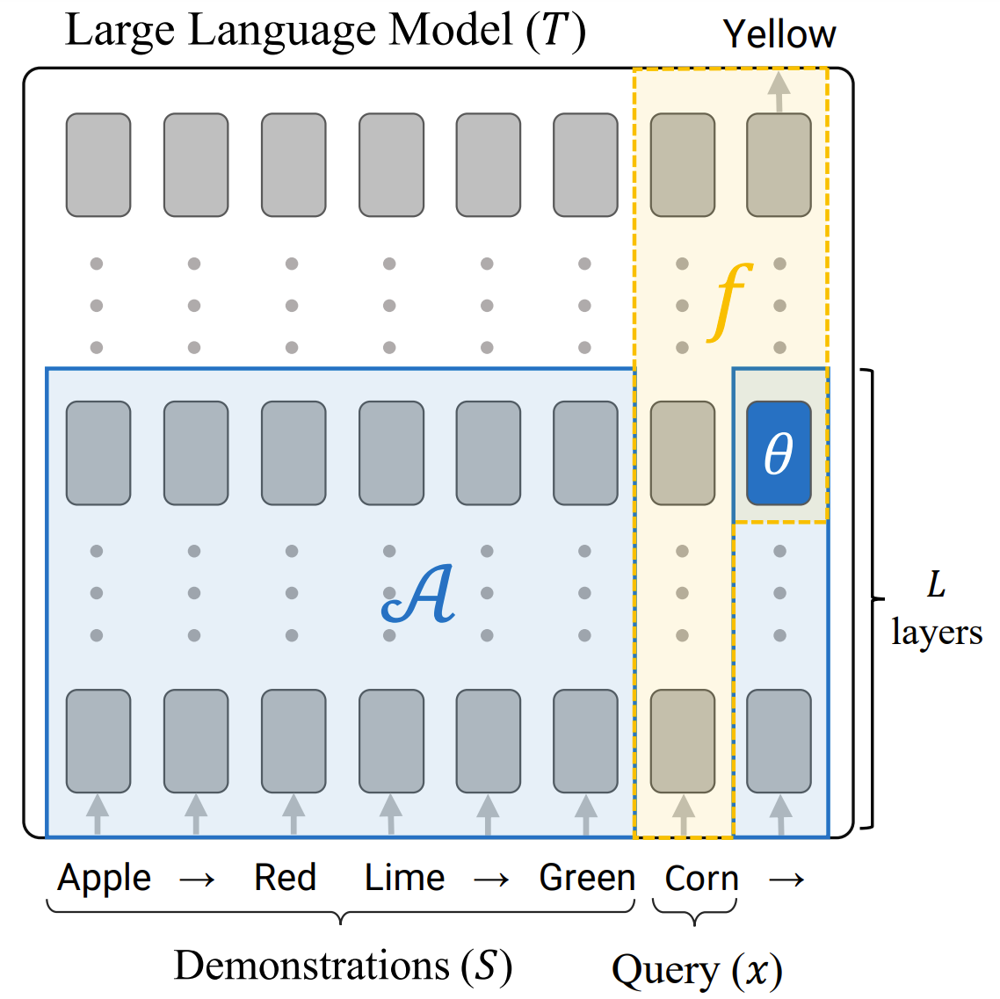

# In-Context Learning Creates Task Vectors
This is the official code repository for the paper [In-Context Learning Creates Task Vectors](https://arxiv.org/abs/2310.15916), Roee Hendel, Mor Geva, Amir Globerson. 2023.

**Note** - For correspondence, use the email address: roeehendel@mail.tau.ac.il (not roee.hendel@mail.tau.ac.il)



## Environment Setup
We provide a conda environment file [environment.yml](environment.yml) to create a python environment with all the required dependencies. To create the environment, run the following command:
```
conda env create -f environment.yml -n icl_task_vectors
```
Then, activate the environment:
```
conda activate icl_task_vectors
```

To run experiments using LLaMA, download the original LLaMA weights.
Then, set the environment variable `LLAMA_DIR` to the path of the downloaded weights. 
Finally, convert the weights to huggingface format and place them in `<LLAMA_DIR>/huggingface`.
E.g. for LLaMA 7B, the huggingface weights should be placed in `<LLAMA_DIR>/huggingface/7B`.

## Data
The data is included in the repository. You can also recreate the data by running the following command:
```
python scripts/data/prepare_data.py
```

## Main Experiment
### Running the Experiment
To run the main experiment on the models and tasks defined in [core/experiments_config.py](core/experiments_config.py),
run the following command:
```
./run_script.sh experiments.main
```
This will run the python file [scripts/experiments/main.py](scripts/experiments/main.py).
The results will be saved to `outputs/results/main/<experiment_id>`, in a separate file for each model.

### Generating the Figures
To generate the figures from the paper, run the following command:
```
python scripts/figures/main.py
```
The figures will be saved to `outputs/figures`.

## Conflicting Tasks Experiment
### Running the Experiment
To run the conflicting tasks experiment, run the following command:
```
./run_script.sh experiments.overriding
```
This will run the python file [scripts/experiments/overriding.py](scripts/experiments/overriding.py).
The results will be saved to `outputs/results/overriding`, in a separate file for each model.

### Generating the Figures
To generate the figures from the paper, run the following command:
```
python scripts/figures/overriding.py
```
The figures will be saved to `outputs/figures`.

## Task Vector Robustness Experiment
To run the task vector robustness experiment, and generate the figures from the paper, run the following command:
```
./run_script.sh experiments.task_vector_robustness
```
This will run the python file [scripts/experiments/task_vector_robustness.py](scripts/experiments/task_vector_robustness.py).
The figures will be saved to `outputs/figures`.
